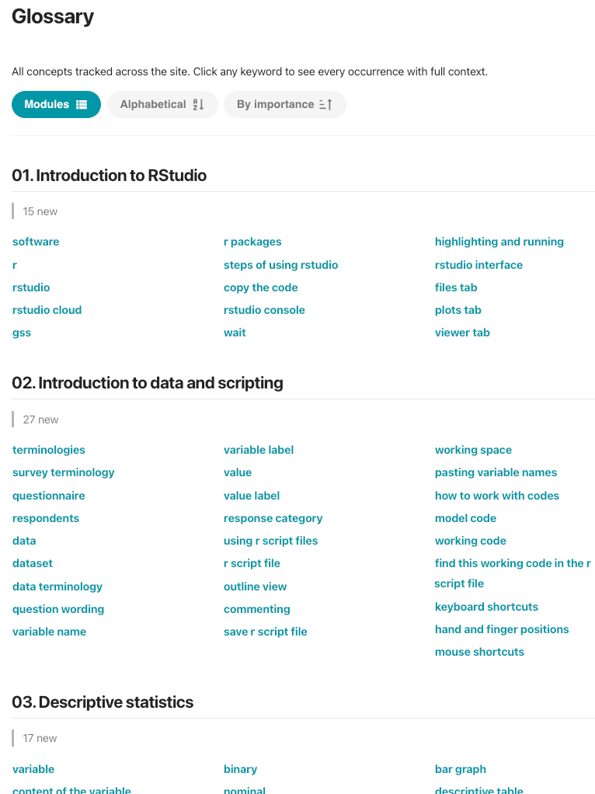
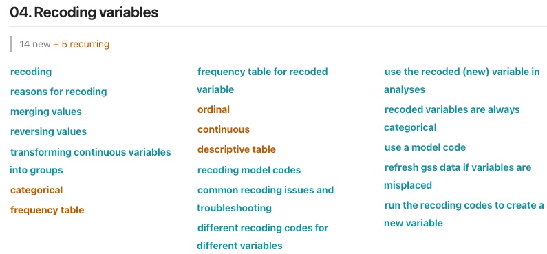
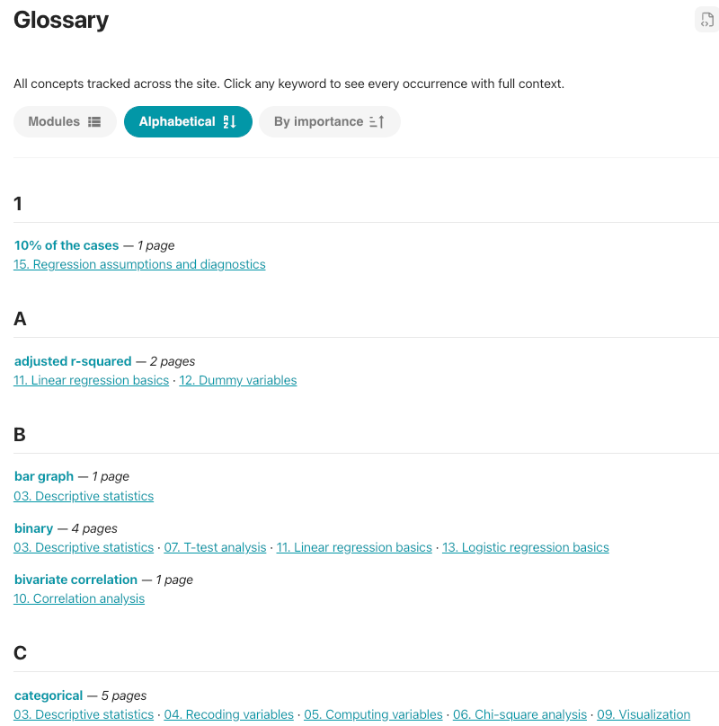
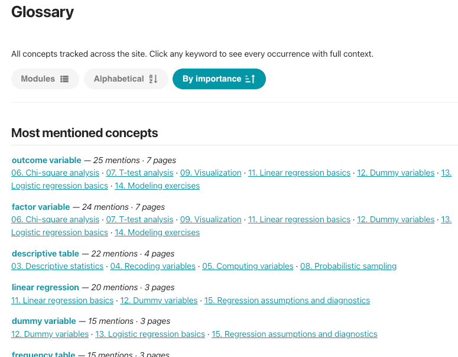

# Glossary
- The [[glossary]] is a site-wide list of every concept, generated from the [[wikilink|wikilinks]].
    - A new wikilink concept appears in the glossary on the next build.

# [[Glossary views]]
1. [[By page]]
2. [[Alphabetical]]
3. [[By importance]]
- | View | Groups concepts by | Good for |
    | --- | --- | --- |
    | By page | The page where the concept first appears | Reviewing one topic |
    | Alphabetical | A to Z | Looking a term up |
    | By importance | Most to least | Looking most used concepts |

## [[By page]] view
- { width="500" }
    - This view also shows recurring concepts in a different color
        - { width="500" }

## [[Alphabetical]] view
- { width="500" }

## [[By importance]] view
- { width="500" }

# Glossary #settings
- Glossary is customized in [[zensical.toml]] file.
    - ```toml linenums="1" 
    [project.extra.knotis.glossary]
    enabled = true
    default_view = "by_page"
    page_view_label = "Pages"
    exclude_paths = []
    order = []
    ```
        - **Line 2:** Default is `true`. `false` turns the glossary feature.
            - When enabled, Knotis generates a `glossary.md` page.
        - **Line 3:** Starting view: `alphabetical` or `by_page`.
        - **Line 4:** Label on the by-page view button.
        - **Line 5:** Skip concepts that appear only on these paths.
        - **Line 6:** In the **by page** view, sections or pages are ordered.

