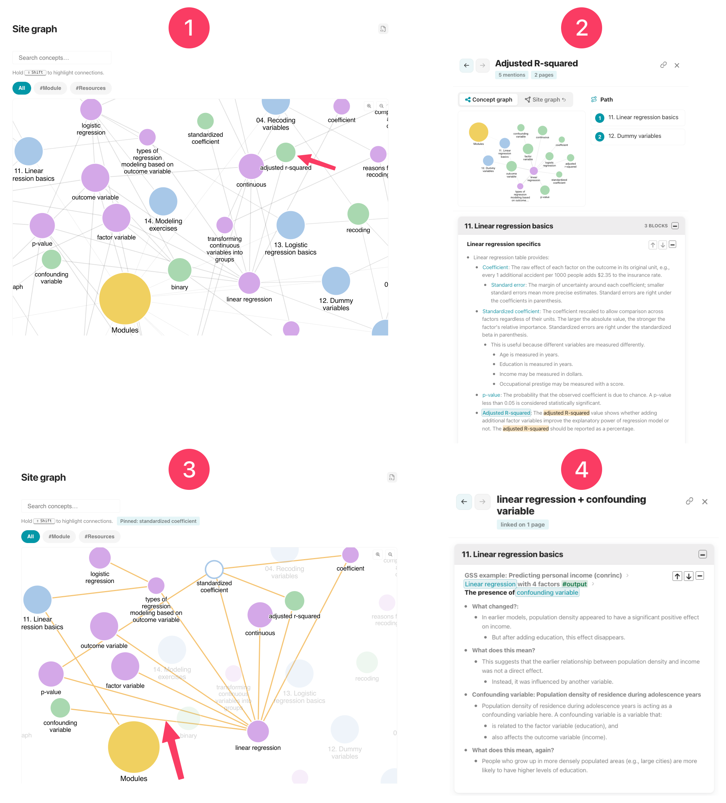
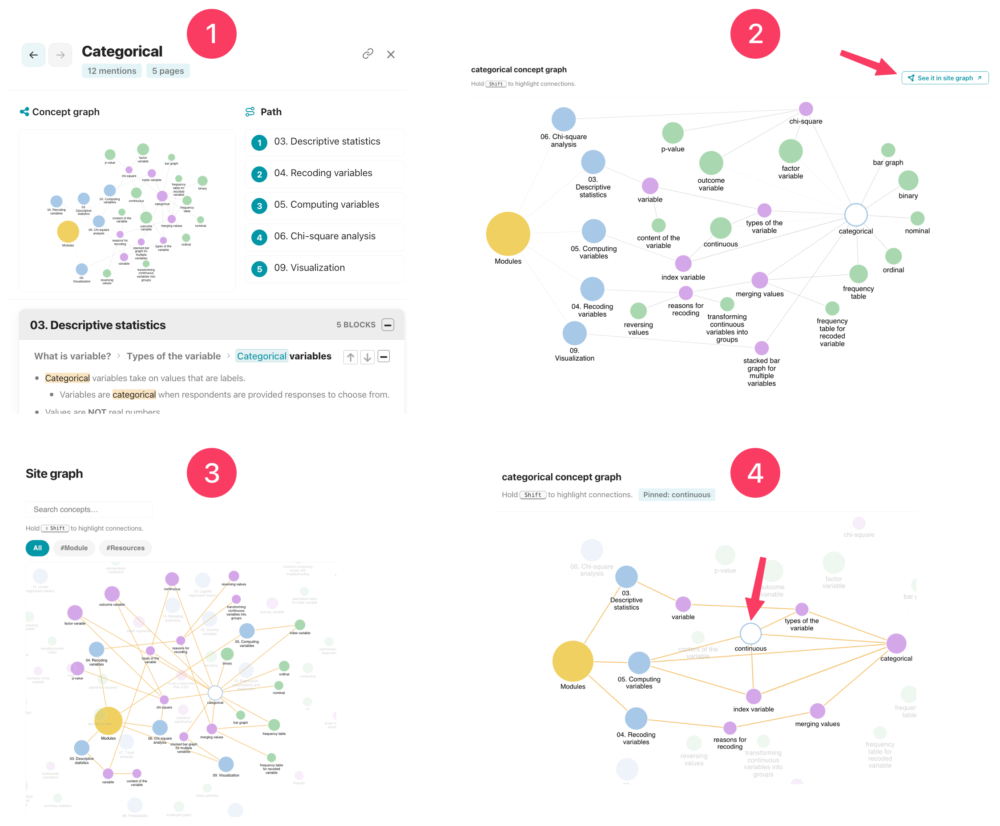

# [[Graphs]]
- Knotis builds three graphs:
    1. [[Site graph]],
    2. [[Page graph]], and
    3. [[Concept graph]].
- Graphs turns a site into a map of connected pages and concepts.
 - Graphs are generated by the [[wikilink|wikilinks]] and,
     - The [[outlining|outline]] defines the graph hierarchy.
# [[Site graph]] 
- The site graph shows the whole course at a glance.
    - Every page is a node, linked by shared concepts and navigation order.
    - It has its own page in the site, so users can open the site graph at any time.
- !!! note "Site graph: Nodes - Lines - Search - Filtering"
    - **Nodes**:
        - **Section nodes:** Top-level sections (for example Modules, Resources).
        - **Page nodes:** Each page.
        - **Concept nodes:** Every wikilink in the course.
            - Larger circles mean the concept appears on more pages.
    - **Lines**:
        - **Section → page:** Site navigation.
        - **Page → concept:** The concepts mentioned on that page.
        - **Concept → concept:** Parent/child structure.
    - **Search**:
        - Concepts are searchable in the site graph.
    - **Filtering:**
        - By default, it shows "all" pages.
        - It can be filtered by the [[page tags]].
## Browsing [[site graph]]
- 
    1. The default view. The user clicks on "standardized coefficient".
    2. The pane opens with:
        1. "Standardized coefficient" [[concept graph]].
        2. Its [[path]], showing the two pages mentions this concept.
        3. The context.
    3. This time, the user hovers "standardized coefficient" and holds ++shift++ to highlight its connections.
        1. This is the [[concept graph]] of "standardized coefficient" within the site graph.
            1. When a site graph freeze is active, sibling concept links appear. Sibling links are normally hidden from the base site graph.
        2. Just like in any graph, the links are clickable. The user clicks the link between "confounding variable" and "linear regression."
    4. The pane opens the context where "confounding variable" and "linear regression" are mentioned together.
## [[Site graph]] #settings
- Site graph is customized in [[zensical.toml]] file.
    - ```toml linenums="1" 
    [project.extra.knotis.site_graph.graph]
    enabled = true
    default_view = "all"
    exclude_tags = []
    exclude_paths = []
    exclude_wikilinks = []
    ```
        - **Line 2:** Default is `true`. `false` turns the site graph feature off.
        - **Line 3:** Default is `all`. [[Page tags]] can be used here.
        - **Line 4:** Page tags can be excluded here.
        - **Line 5:** Sections or pages to remove from the site graph.
        - **Line 6:** Wikilinks to remove from the site graph.

# [[Page graph]]
- The page graph is for active page only.
    - It shows the concepts on the page and how they relate to each other.
- !!! note "Page graph: Nodes - Lines"
    - **Nodes**:
        - **Page node:** Active page.
        - **Concept nodes:** Every wikilink in the page.
            - Larger circles mean the concept receives many links from other concepts.
    - **Lines**:
        - **Page → concept:** The concepts mentioned on that page.
        - **Concept → concept:** Parent/child/sibling structure.
## Browsing [[page graph]]
- 
    1. The user opens a page, which shows the page graph preview at the top right corner.
        1. The user clicks that graph and clicks on "binary."
    2. The pane opens with:
        1. "Binary" [[concept graph]].
        2. Its [[path]], showing the four pages mentions this concept.
        3. The context.
    3. This time, the user hovers "binary" and holds ++shift++ to highlight its connections.
        1. This is the teaching path of this specific concept within the page. The hierarchy between the concepts shows this path.
        2. Just like in any graph, the links are clickable. The user clicks the link between "variable" and "types of variable."
    4. The pane opens the context where these two concepts mentioned together.

## [[Page graph]] #settings
- Site graph is customized in [[zensical.toml]] file.
    - ```toml linenums="1" 
    [project.extra.knotis.page_graph.graph]
    enabled = true
    exclude_paths = []
    exclude_wikilinks = []
    ```
        - **Line 2:** Default is `true`. `false` turns the page graph feature off.
        - **Line 3:** Sections or pages that will not show page graph.
        - **Line 4:** Wikilinks to remove from the page graph.

# [[Concept graph]]
- The concept graph centers on one concept.
    - It shows that concept's neighbors, the ideas it is mentioned alongside.
        - A small preview appears inside every [[pane]]. Clicking through opens the full view.
- !!! note "Concept graph: Nodes - Lines"
    - **Nodes**:
        - **Page nodes:** Pages that mention the concept.
        - **Concept nodes:** Every wikilink that has connection with the concept
            - Larger circles mean the concept receives many links from other concepts.
    - **Lines**:
        - **Page → concept:** The concepts mentioned on that page.
        - **Concept → concept:** Parent/child/sibling structure.

## Browsing [[concept graph]]
- 
    1. The user clicks on "categorical" on a page, graph, pane, or glossary. The pane opens with:
        1. "Categorical" [[concept graph]].
        2. Its [[path]], showing the five pages mentions this concept.
        3. The context.
            1. The user clicks on "Concept graph" preview.
    2. The concept graph shows all the pages, concepts, and links involved "categorical."
        1. The user clicks "see it in site graph".
    3. The [[site graph]] opens. It automatically freezes the concept.
        1. This is the concept graph within the site graph.
    4. The user clicks on the concept in the site graph, hovers "continuous" and holds ++shift++ to highlight its connections.
        1. This is the teaching path of "categorical" and "continuous" together across the pages.

## [[Concept graph]] #settings
- Concept graph is customized in [[zensical.toml]] file.
    - ```toml linenums="1" 
    [project.extra.knotis.concept_graph.graph]
    enabled = true
    exclude_paths = []
    exclude_wikilinks = []
    ```
        - **Line 2:** Default is `true`. `false` turns the concept graph feature off.
        - **Line 3:** Sections or pages that will not show concept graph.
        - **Line 4:** Wikilinks to remove from the concept graph.