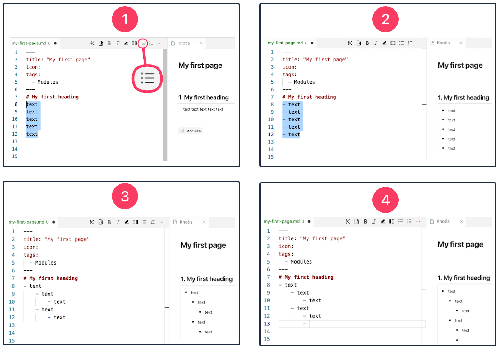
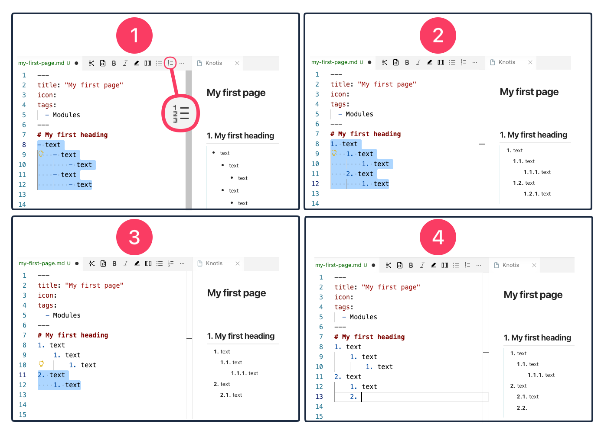
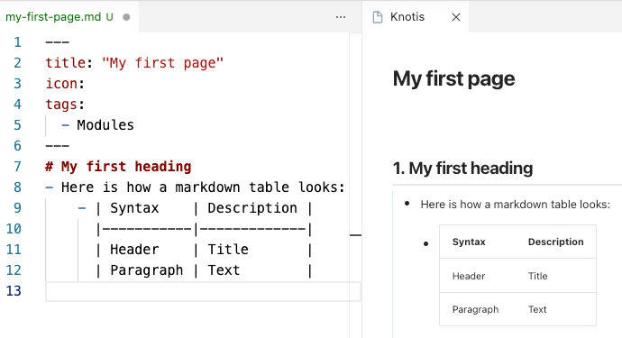
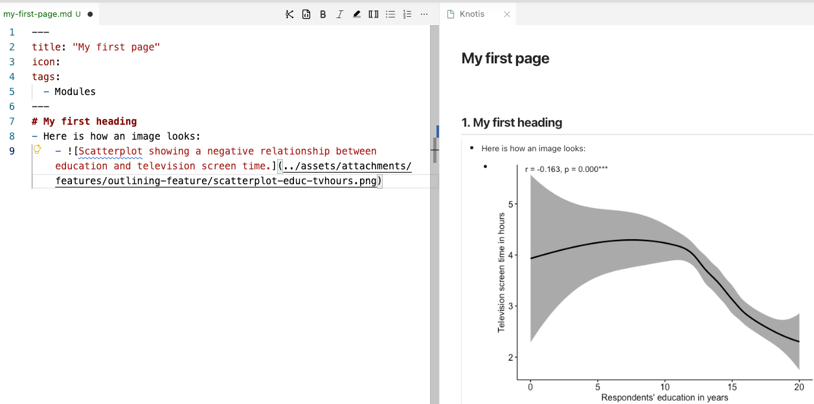
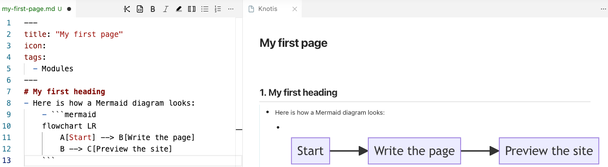
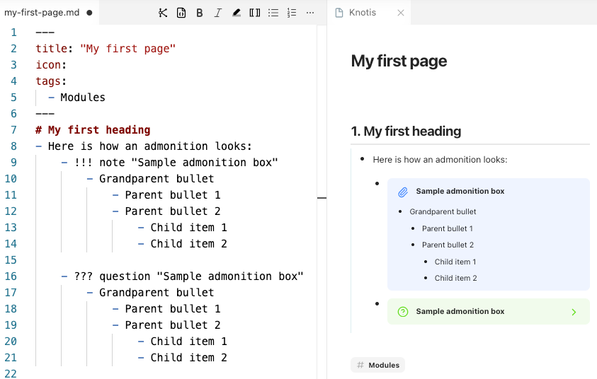
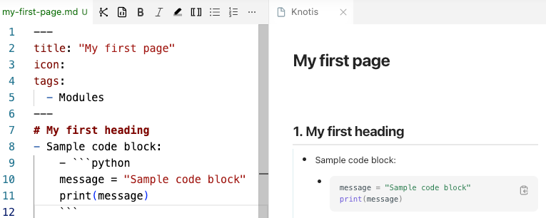
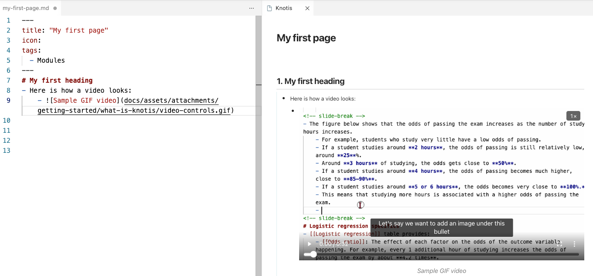

# [[Outlining]]
- Pages are written in [[Markdown]].
    - A quick reference is available at [Markdown Guide: Cheat Sheet](https://www.markdownguide.org/cheat-sheet/){ target="_blank" rel="noopener noreferrer" }.
- One important difference in Knotis: pages are organized as outlines.
    - Headings create the main sections.
        - Under each heading, content is written as bullets.
        - Paragraph-style writing is avoided, so each idea has a clear place in the outline.
        - A bullet outline states the structure directly.
            - A child bullet belongs to the bullet above it.
                - A grandchild bullet belongs to its parent, and so on.
    - This outline structure helps the site understand how ideas are connected. 
- Knotis parses this nesting and uses it for three things:
    - **[[Pane]] context.** When a pane opens, it shows the customized number of bullets.
    - **[[Graphs|Graph]] edges.** A concept nested under another concept becomes a parent to child edge.
    - **[[Content tags]] boundaries.** Content tags use the nesting to know where a block starts and ends.

# [[Knotis VS Code extension|Writing with the VS Code extension]]
- The [[Knotis VS Code extension]] is recommended for writing pages.
    - It provides a preview while writing and includes editing tools.
## [[Bullets]]
1. Place the cursor anywhere on a plain text line (or highlight), then click the **Bullet List** icon. 
2. The list has bullets.
    1. Click the icon again to remove the bullets.
3. Press ++tab++ to indent a list item and make it a child item.
    1. Press ++shift+tab++ to outdent it.
3. Press ++enter++ while editing a bulleted list:
    1. At the end of a list item, it creates the next sibling item.
    2. In the middle of a list item, it splits the text into two sibling items.
    3. On a blank nested list marker, it outdents one level.
    4. On a blank top-level list marker, it clears the marker and exits the list.

    - 

## [[Numbered list]]
1. Place the cursor anywhere on a plain text line or bullet (or highlight), then click the **Numbered List** icon.
2. The list has nested numbers.
    1. Click the icon again to remove the numbering.
2. Press ++tab++ to indent a list item and make it a child item.
    1. Press ++shift+tab++ to outdent it.
3. Press ++enter++ while editing a numbered list:
    1. At the end of a list item, it creates the next sibling item.
    2. In the middle of a list item, it splits the text into two sibling items.
    3. On a blank nested list marker, it outdents one level.
    4. On a blank top-level list marker, it clears the marker and exits the list.

- 
- !!! info "Nesting depth #tip"
    - Three or four levels of nesting is normal.
        - A heading,
            - a bullet under it,
                - a child bullet, and
                    - sometimes a grandchild bullet for a worked detail.
    - Nesting deeper than that usually means the section should be split into a new heading instead.

### [[Bullets]] and [[numbered list]] together
- A heading or bullet can introduce a list, and its children can switch from bullets to numbers. For example:
- Grandparent bullet
    1. Parent item 1 (parent sibling 1)
    2. Parent item 2 (parent sibling 2)
        - Child item 1 (child sibling 1)
        - Child item 2 (child sibling 2)

## [[Markdown table]]
1. Place the cursor anywhere on the first row of the markdown table, then click the **Numbered List** icon.
    1. A selected Markdown table becomes one list item. Only the first row gets the bullet.
2. ++tab++ for indenting and ++shift+tab++ for outdenting:
    1. When the cursor is inside a table, the whole block moves together.

- Here is how a markdown table looks:
    - 
## [[Image]]
1. Save the image to the [[assets folder]].
2. Copy the image:
    1. :fontawesome-brands-windows: &nbsp; ++ctrl+c++
    2. :fontawesome-brands-apple: &nbsp; ++cmd+c++ 
3. Place the cursor on the line where the image should go, then press:
    1. :fontawesome-brands-windows: &nbsp; ++ctrl+v++
    2. :fontawesome-brands-apple: &nbsp; ++cmd+v++ 
4. Place the cursor anywhere on the pasted text (or highlight), then click the **Bullet List** icon.
5. Replace the placeholder `[alt text]` with a short description of what the image shows, or, if decorative, leave it blank, `[]`.

- Here is how an image looks:
    - 

## [[Mermaid diagram]]
1. Place the cursor where the diagram should go.
2. Add a fenced code block ` ``` ` and write `mermaid` after the opening backticks.
3. Place the cursor anywhere on the first line of the diagram block (or highlight), then click the **Bullet List** icon.
    1. The whole diagram becomes one list item.
4. Press ++tab++ to indent the diagram under the bullet or heading it belongs to.

- Here is how a Mermaid diagram looks:
    - 

## [[Admonition]]
1. Place the cursor where the admonition box should go.
2. Type `!!!`, the admonition type, and the title in quotation marks.
    1. For example, `!!! note "Sample admonition box"`.
    2. Use `???` instead of `!!!` to make the box closed and expandable.
    3. Use `???+` to make the box open, but still closable.
    4. Available types: `note`, `abstract`, `info`, `tip`, `success`, `question`, `warning`, `failure`, `danger`, `bug`, `example`, `quote`.
3. Write the content of the box as indented bullets under that first line.
4. Place the cursor anywhere on the first line of the admonition block (or highlight), then click the **Bullet List** icon.
    1. The whole admonition becomes one list item.
5. Press ++tab++ to indent the admonition under the bullet or heading it belongs to.
6. To add child bullets after the admonition box, leave a blank line after the box content.

- Here is how an admonition looks:
    - 

## [[Code block]]
1. Place the cursor where the code should go.
2. Add a fenced code block ` ``` ` and write the language name after the opening backticks.
    1. For example, use `python`, `r`, `bash`, or `text`.
3. Place the cursor anywhere on the code block (or highlight), then click the **Bullet List** icon.
    1. The whole code block becomes one list item.
4. Press ++tab++ to indent the code block under the bullet or heading it belongs to.

- Here is how a code block looks:
    

## [[Video]]
1. Save the video to the [[assets folder]].
2. Copy the video file:
    1. :fontawesome-brands-windows: &nbsp; ++ctrl+c++
    2. :fontawesome-brands-apple: &nbsp; ++cmd+c++ 
3. Place the cursor on the line where the video should go, then press:
    1. :fontawesome-brands-windows: &nbsp; ++ctrl+v++
    2. :fontawesome-brands-apple: &nbsp; ++cmd+v++ 
4. Place the cursor anywhere on the pasted text (or highlight), then click the **Bullet List** icon.
5. Replace the placeholder `[alt text]` with a short description of what the video shows.
    1. Files ending in `.mp4` or `.gif` become media players in the site.

- Here is how a video looks:
    - 