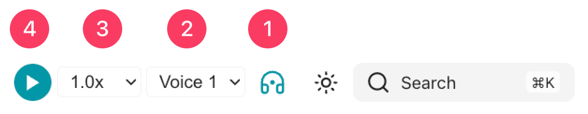
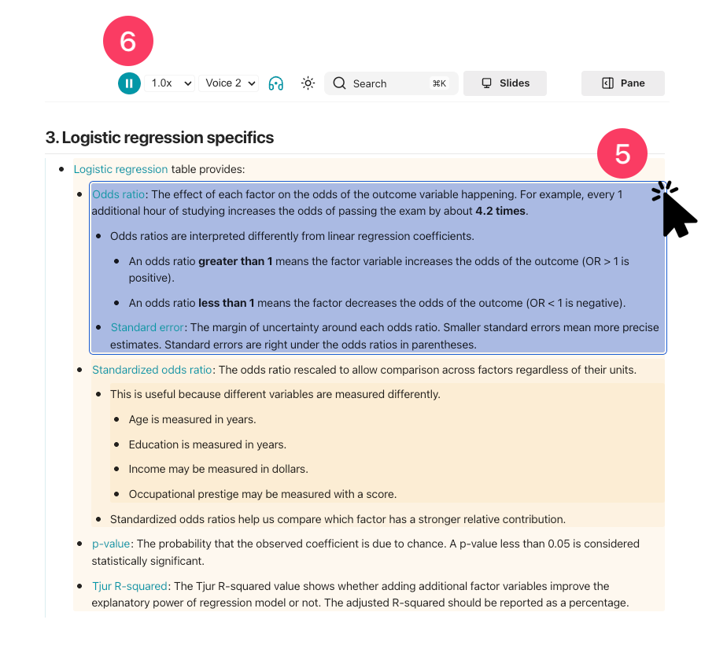

# [[Read aloud]]
- Read aloud is a built-in text-to-speech control for pages.
    - It uses the voices already available in the reader's browser or device.
    - It is useful when users want to listen while reading, review a page hands-free, or use the site with audio support.

# [[Read aloud]] play
1. Click the headphones icon in the header.
2. Choose the reading speed.
3. Choose a voice.
4. Click play to start from the beginning of the page.
    - 
5. Click a heading, bullet, paragraph, or quote to start reading from that point.
6. Click the headphones icon again or press ++esc++ to stop.
    - 

# What gets read
- [[Read aloud]] reads the main page content:
    - Headings,
    - Bullets and numbered lists,
    - Paragraphs,
    - Block quotes.
- It skips page controls and layout elements:
    - Navigation,
    - Sidebars,
    - Code blocks,
    - Tables,
    - Figures,
    - Diagrams.
- Wikilink aliases are read as the visible text on the page.
    - `[[concept|visible label]]` is read as `visible label`.
- Changing pages stops the current reading.

# Read aloud #settings
- Read aloud is customized in [[zensical.toml]] file.
    - ```toml linenums="1" hl_lines="2"
    [project.extra.knotis.readaloud]
    enabled = true
    ```
        - **Line 2:** Default is `true`. `false` hides the read-aloud control.

- Content tags are customized in [[zensical.toml]] file.
    - ```toml linenums="1"
    [project.extra.knotis.content-tags]
    enabled = true
    nav_chips = true
    ```
        - **Line 2:** Default is `true`. `false` turns off the generated content tags page.
            - Panes and search can still use content tags.
        - **Line 3:** Default is `true`. `false` hides tag chips in the sidebar.

## [[Skipping sections]] #settings
- A heading can be skipped by adding `data-readaloud-exclude` to the heading.
    - ```markdown
    Module items { data-readaloud-exclude }
    ```
        - The heading and everything under it is skipped until the next heading at the same level.