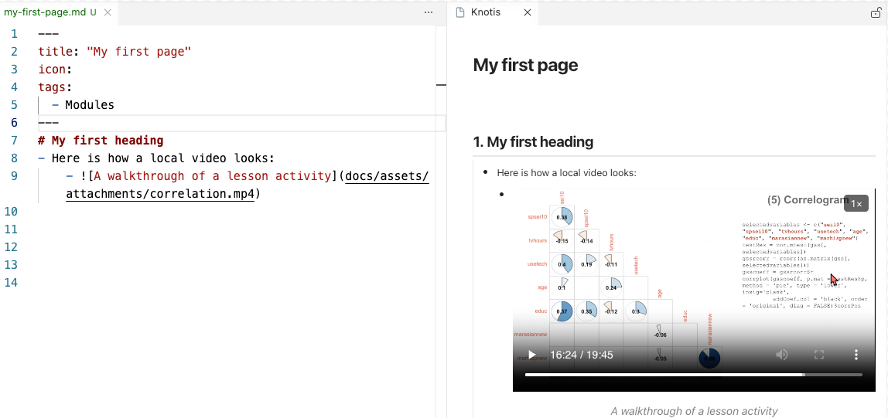
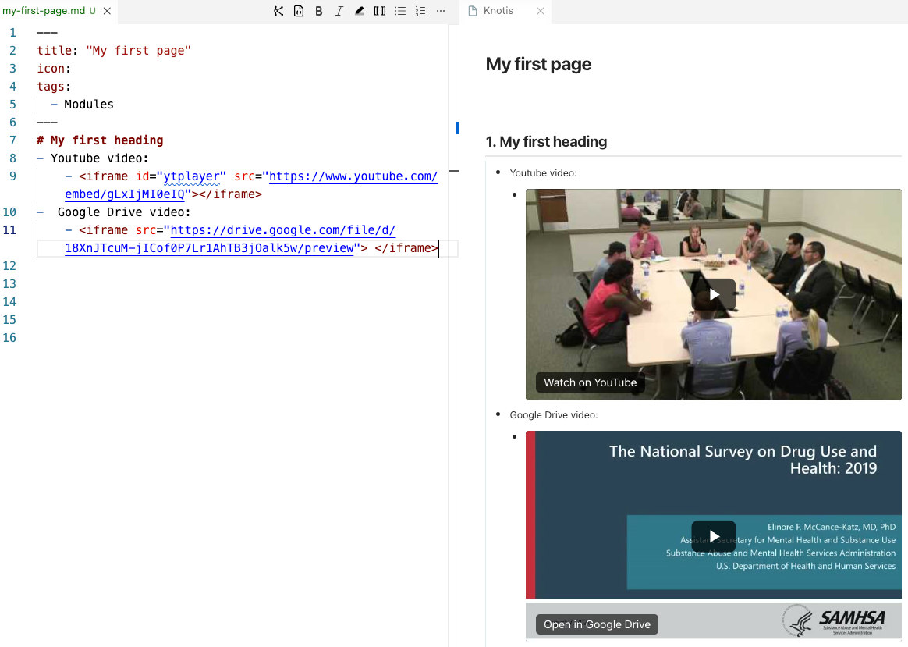

<!-- slide-break -->
# [[Video controls]]
- Video controls turn local `.mp4` and `.gif` files into media players on the page.
    - Users can pause playback, change playback speed, and use closed captions when available.
    - Media appears with bullets, inside [[slide mode|slides]] and [[pane]].
        - The player aligns with the surrounding outline, so it stays connected to the instruction around it.
- Externally hosted videos embedded with an HTML `<iframe>` also keep their bullet alignment, pane rendering, and slide placement.
<!-- slide-break -->
# [[Local videos]]
## [[MP4 files]] and [[GIF files]]
1. Save the media file to the [[attachments folder]].
2. Copy the file:
    1. :fontawesome-brands-windows: &nbsp; ++ctrl+c++
    2. :fontawesome-brands-apple: &nbsp; ++cmd+c++ 
3. Place the cursor on the line where the media should go, then press:
    1. :fontawesome-brands-windows: &nbsp; ++ctrl+v++
    2. :fontawesome-brands-apple: &nbsp; ++cmd+v++ 
4. Place the cursor anywhere on the pasted text (or highlight), then click the **Bullet List** icon.
5. Replace the placeholder `[alt text]` for the video caption, or leave it blank, `[]`.
    - ```markdown
    { width="700" }
    ```
    - ```markdown
    { width="700" }
    ```
- Here is how a local video looks:
    - 

- Knotis also supports raw local `<video>` HTML when a page already has that format.
    - Start the outline item with `<video>`, such as `- <video width="640" height="360" controls>`.
    - Put the `<source>` line and closing `</video>` directly under it.
<!-- slide-break -->
## [[Closed captions]]
- Closed captions are supported with `.vtt` files.
    1. Save the caption file in the same folder as the video.
    2. Use the same file name as the video, but end it with `.vtt`.
        1. For example, `lesson-demo.mp4` and `lesson-demo.gif` can use `lesson-demo.vtt`.
    3. Captions are added automatically when the site finds the matching `.vtt` file.
<!-- slide-break -->
# [[Externally hosted videos]]
- Knotis supports bullets for externally hosted videos through provider `<iframe>` embed code.
    - Use the provider's embed snippet, not the ordinary watch-page link.
    - Put the bullet marker before the opening `<iframe>` when the video belongs inside the outline.
    - The embed stays aligned under the bullet in the page, [[pane]], and [[slide mode|slides]].
- :simple-youtube: **YouTube videos** should use an `/embed/` URL: 
    - Start with `- <iframe src="https://www.youtube.com/embed/M7lc1UVf-VE"></iframe>`.
- :simple-googledrive: **Google Drive videos** should use a `/preview` URL:
    - Start with `- <iframe src="https://drive.google.com/file/d/FILE_ID/preview"></iframe>`.
        - Here is how externally hosted videos look:
            - 

