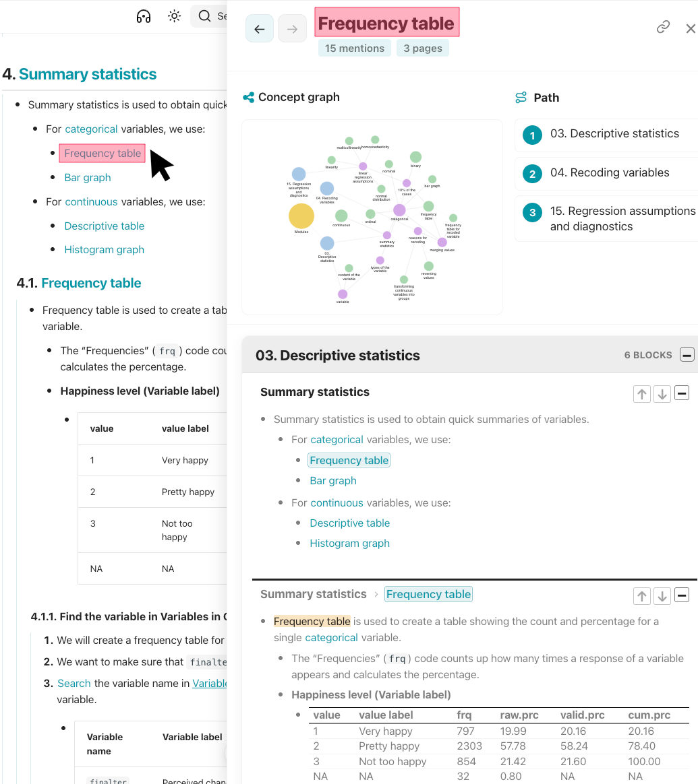

# [[Wikilink]]
- A [[wikilink]] is a concept or phrase written in double brackets, for example `[[mean]]` or `[[frequency table]]`.
    - Every occurrence of that concept or phrase across the site is connected.
        - Unlike normal Markdown links, wikilinks do not point to one fixed page.
        - Wikilinks can appear on many pages, and the site keeps those mentions together.
            - Wikilinks are the source that [[pane]], the [[glossary]], [[graphs]], and [[search]] are built from.

# Syntax
## Standard [[wikilink|wikilinks]]
- On a page, wikilinks look like colored concept links.
    - ```markdown
    [[frequency table]]
    [[linear regression]]
    [[sampling strategy]]
    ```
- Wikilinks match by concept, not by exact text:
    - All three of these point to one concept::
        - ```markdown
        [[frequency table]]
        [[Frequency table]]
        [[Frequency Table]]
        ```
- Clicking a wikilink opens the [[pane]].
    - 

- !!! info "Link selectively #tip"
    - If every concept is a wikilink, none of them stand out.
        - Wikilink only the terms that should appear in the pane and graphs.
## [[Alias]] links
- An alias allows visible wording to change without creating a second concept.
- Write the concept before the pipe character, `|`, and the visible words after it:
    - ```markdown
    [[frequency table|frequency tables]]
    [[linear regression|linear regression model]]
    [[sampling strategy|sampling strategies]]
    ```
        - The first one displays as "frequency tables" (blue link) but still belongs to the wikilink concept `frequency table`.

- !!! info "Why use aliases #tip"
    - **Grammar:** singular vs plural, “table” vs “tables.”
    - **Wording:** a longer or shorter phrase that still means the same idea.
    - **Abbreviations:** `[[standard deviation|SD]]` without a separate `[[SD]]` concept.
        - The alias is display-only.
            - It does not create a new wikilink, glossary entry, or graph node.

## [[Reference]] links
- Use `ref` after the pipe character, `|`, to mark a wikilink as a reference rather than a causal mention.
- The same concept can be marked with `|ref` in more than one place; each reference becomes a separate card.
    - ```markdown
    [[save your file|ref]]
    ```
- !!! info "When to use references: procedural reminders #tip"
    - Suppose a guideline explains how to save a file or take a screenshot of a graph, and reminders to follow that guideline appear on many pages.
    - When users click `[[save your file]]` or `[[take a screenshot]]`, the pane should show the relevant guidelines rather than every casual mention of those phrases.
        - A standard wikilink adds every mention to the pane and graphs.
        - A reference shows only the pages where the concept is marked with `|ref`.

# Wikilinks #settings
- Wikilink colors are customized in [[zensical.toml]] file.
    - ```toml linenums="1" hl_lines="2 3"
    [project.extra.knotis.wikilinks]
    default = "#0197a7"
    slate = "#fda4af"
    ```
        - **Line 2:** Wikilink color in light mode.
        - **Line 3:** Wikilink color in dark mode.