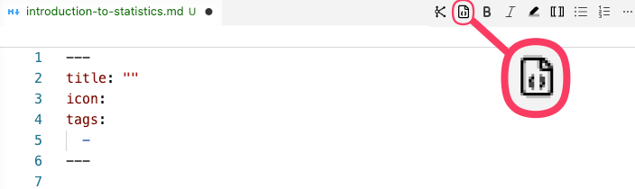

# [[scaffold|Scaffolded]] page files and section folders
- Inside `docs/`, there are template folders and pages.
    - ```text
    my-site-folder/
    ├── docs/
    │   ├── section-1/
    │   │   └── page-1.md … page-5.md
    │   ├── section-2/
    │   │   └── page-6.md … page-10.md
    │   ├── explore/
    │   │   ├── content-tags.md
    │   │   ├── glossary.md
    │   │   └── site-graph.md
    │   ├── assets/
    │   │   └── attachments/
    │   │       ├── section-1/
    │   │       │   └── page-1/ … page-5/
    │   │       └── section-2/
    │   │           └── page-6/ … page-10/
    │   ├── overrides/
    ```
## Edit a section folder and a page file #settings
- First, rename `section-1` in the local directory, such as `modules`, `lessons`, `resources`.
- Then, rename the`page-1.md` such as `introduction-to-statistics`
- Each template page comes with a [[YAML]] at the top. Edit the page title, and put the section name as a [[page tags|page tag]].
    - ``` yaml
    ---
    title: "Introduction to statistics"
    icon:
    tags:
        Modules
    ---
    ```
        - Then, open [[zensical.toml]] file and edit the `Site tree` section:
            - ```text
        # Site tree
        nav = [
            { "Home" = "index.md" },
            { "Modules" = [
                { "Introduction to statistics" = "modules/introduction-to-statistics.md" },
                { "Page 2" = "section-1/page-2.md" },...
        ]
        ```
- !!! info "Folder and file names #tip"
    - Use hyphens `-` or underscores `_` instead of spaces in folder and file names.
        - This helps prevent problems in URLs, terminal commands, and publishing tools.
## Create a section folder and a page file
- Alternatively, instead of using template folder and pages files (.md), delete them and create your own.
    - Open the file in [[VS code]] and use [[Knotis VS Code extension]]
        - Click `insert front matter` button, which will paste a template [[YAML]], and edit inside.
            - 

## [[Generated folders and page files]]
### [[Explore folder]]
- The `docs/explore` folder and the following three files are automatically created:
    1. [[content tags|content-tags]].md
    2. [[glossary]].md
    3. [[site graph|site-graph]].md

    - These files are editable in a limited way:
        - They can be moved them to another folder.
        - They can be renamed, as long as the matching path in zensical.toml is updated.
        - [[YAML]] values as title, icon, and tags can be changed.
            - The `knotis_generated` value should **not** be changed.
                - Changing or removing that argument can make the generated page stop being recognized.

### [[Attachments folder]]
- The `docs/assets/attachments` folder and its subfolders are automatically created.
    - The folder names can be changed.
- !!! info "Organize attachments by section and page #tip"
    - Inside the existing attachment folder, create one folder for each section and one subfolder for each page.
        - This keeps images, media, PDFs, and other files grouped with the page where they are used.

### [[Overrides folder]] #settings
- The `docs/overrides` folder is automatically created.
    - It contains template files that support site-wide layout and page rendering.
- For example, a specific page can turn off heading numbers and/or heading guide lines with:
    - ``` yaml linenums="1" hl_lines="6 7 8"
    ---
    title: "Introduction to statistics"
    icon:
    tags:
        Modules
    knotis_content:
      heading_numbering: false
      heading_guides: false
    ---
    ```
        - **Line 6:** Starts the `knotis_content` page settings.
        - **Line 7:** Turns off automatic heading numbers on this page.
        - **Line 8:** Turns off the vertical guide lines that show the outline structure under headings.

- !!! info "[[Content layout]] #settings"
    - Use the page-level `knotis_content` YAML shown in the [[Overrides folder]] section when only one page should opt out.
    - Heading numbers, heading guide lines, and styled sidebar section groups can be turned off for the whole site in [[zensical.toml]].
        - ``` toml linenums="1" hl_lines="2 3 4 5"
        [project.extra.knotis.content]
        heading_numbering = true
        heading_guides = true
        generator = true
        styled_section_groups = true
        ```
            - **Line 2:** `heading_numbering = true` adds automatic section numbers such as `1.`, `1.1.`, and `1.1.1.`.
                - Set it to `false` to turn off heading numbers across the site.
            - **Line 3:** `heading_guides = true` adds the vertical guide lines that show the outline structure under headings.
                - Set it to `false` to turn off heading guide lines across the site.
            - **Line 4:** `generator = true` adds the Knotis and Zensical footer attribution.
                - Set it to `false` to hide.
            - **Line 5:** `styled_section_groups = true` uses the Knotis navigation bar section-group styling.
                - Set it to `false` to use the default navigation styling.
                    - 

# Before publishing
- This page is for shaping the site before it goes live.
- Before publishing the site,
    1. Review the **Features** in the next section.
    2. Finalize pages, folders, attachments, and `zensical.toml` settings.
    3. When the site is ready to go online, continue to [Publish the site](../getting-started/publish-the-site.md).
