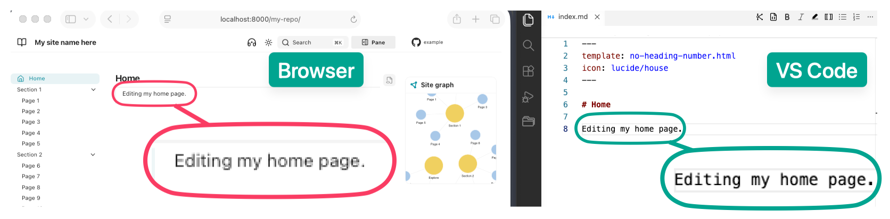

# [[Required tools]]
1. [[Terminal]].
    - **Recommended:** :simple-warp: [Warp](https://www.warp.dev/){ target="_blank" rel="noopener noreferrer" }
2. A plain-text editor.
    - **Recommended:** :octicons-vscode-24: [VS Code](https://code.visualstudio.com/){ target="_blank" rel="noopener noreferrer" } with
        - :knotis-knotis-mark: [Knotis VS Code extension](https://github.com/ttezcann/vscode-knotis){ target="_blank" rel="noopener noreferrer" } (A live preview and Knotis-compatible Markdown editing commands).
3. A hosting service for publishing the site.
    - **Recommended:** :simple-github: [[GitHub]] Pages.
        - Sign up at [GitHub.com](https://github.com/){ target="_blank" rel="noopener noreferrer" }. 

# [[Knotis installation]]
- :lucide-badge-check: **Prerequisite:** Install :fontawesome-brands-python: Python 3.11+ from [python.org](https://www.python.org/downloads/){ target="_blank" rel="noopener noreferrer" }.
    - Then, run the following codes in [[terminal]].

        === ":material-apple: macOS"
            - ```bash
            python3 -m venv .venv
            source .venv/bin/activate
            pip install knotis
            ```
        === ":fontawesome-brands-windows: Windows"
            - ```powershell
            python3 -m venv .venv
            .venv\Scripts\activate
            pip install knotis
            ```
        === ":material-linux: Linux"
            - ```bash
            python3 -m venv .venv
            source .venv/bin/activate
            pip install knotis
            ```

# Create a [[site folder]]
- Choose where the course site should live on your computer and create an **empty** folder for it.
- Create the site folder manually, or run the following in [[terminal]]:
    - ```bash
    mkdir /path/to/my-site-folder
    cd /path/to/my-site-folder
    ```

# [[Scaffold]] the site
- Run the following in the site folder `cd /path/to/my-site-folder` in [[terminal]]:
    - ```bash
    knotis new .
    ```
        - The `.` means “scaffold the site here,” in the current folder, `/path/to/my-site-folder`.

## What [[scaffold|scaffolding]] creates
- `knotis new` sets up and builds a working site automatically.
    - You do not create `zensical.toml` or the folder layout manually at this stage.
        - It initializes the site tree and then copies the packaged scaffold into it.
- After the command finishes, the folder contains:
    - ```
    my-site-folder/
    ├── docs/
    │   ├── index.md                    starter home page
    │   ├── section-1/
    │   │   └── page-1.md … page-5.md   sample pages (section-1 tag)
    │   ├── section-2/
    │   │   └── page-6.md … page-10.md  sample pages (section-2 tag)
    │   ├── explore/
    │   │   ├── content-tags.md         content tags landing page
    │   │   ├── glossary.md             glossary landing page
    │   │   └── site-graph.md           site graph landing page
    │   ├── assets/                     build output (JSON + mirrored runtime assets)
    │   │   └── attachments/
    │   │       ├── section-1/
    │   │       │   └── page-1/ … page-5/   sample per-page attachment folders
    │   │       └── section-2/
    │   │           └── page-6/ … page-10/  sample per-page attachment folders
    │   └── javascripts/
    │       └── glossary.js             glossary view toggle helper
    ├── assets/                         site theme overrides
    ├── overrides/                      HTML templates and theme hooks
    ├── site/                           built HTML (generated on initial build)
    ├── zensical.toml                   site name, navigation, and settings
    ```
- **[[docs folder|docs]]/:** contains the site’s Markdown pages.
    - The scaffold starts with section folders such as `section-1/`, `section-2/`, and `explore/`.
- **docs/assets/[[attachments folder|attachments]]/:** stores files used by pages, such as images, datasets, PDFs, downloads, and other media.
    - The scaffold creates one attachment folder per sample page so page-specific files have a clear home.
- **[[overrides folder|overrides]]/:** contains optional theme and template overrides.
    - The scaffold includes starter templates such as header controls and per-page layout options.
- **[[zensical.toml]]:** the main site configuration file.
    - Controls the site name, navigation, theme settings, and Knotis/Zensical behavior.
    - Ships with working defaults so the site can build before customization.

# [[Serve]] and [[build]] the site locally
- Build the site and start a local server.
- Run the following in the site folder `cd /path/to/my-site-folder` in [[terminal]]:
    - ``` sh
    knotis serve
    ```
        - The site is live at [http://localhost:8000/](http://localhost:8000/).
        - `knotis serve` rebuilds automatically on every save.
            - 

## When something looks wrong
1. Save the file again.
    1. The reload may have been missed.
2. Hard refresh the browser:
    1. :fontawesome-brands-windows: &nbsp; ++ctrl+shift+r++
    2. :fontawesome-brands-apple: &nbsp; ++cmd+shift+r++ 
3. In [[terminal]]:
    1. Stop `knotis serve` by pressing  ++ctrl+c++
    2. Run `knotis build`, and read any messages it prints.
    3. Run `knotis serve` again.

# [[Upgrade]] Knotis
- Upgrade Knotis to get the latest bug fixes, generated-page updates, and new site features.
    - ```bash
    pip install --upgrade knotis
    ```
- Review the [Changelog](../changelog/changelog.md) before upgrading.
      - The change log lists new features, renamed settings, removed settings, and any steps needed after an update.
- To return to an earlier Knotis version, install that version directly..
    - ```bash
    pip install "knotis==0.1.0"
    ```
        - Replace `0.1.0` with the version to return to.
- !!! note "Version compatibility"
    - [[Knotis]] uses a tested version of [[Zensical]].
        - When new Zensical versions are released, Knotis support is added after compatibility checks.