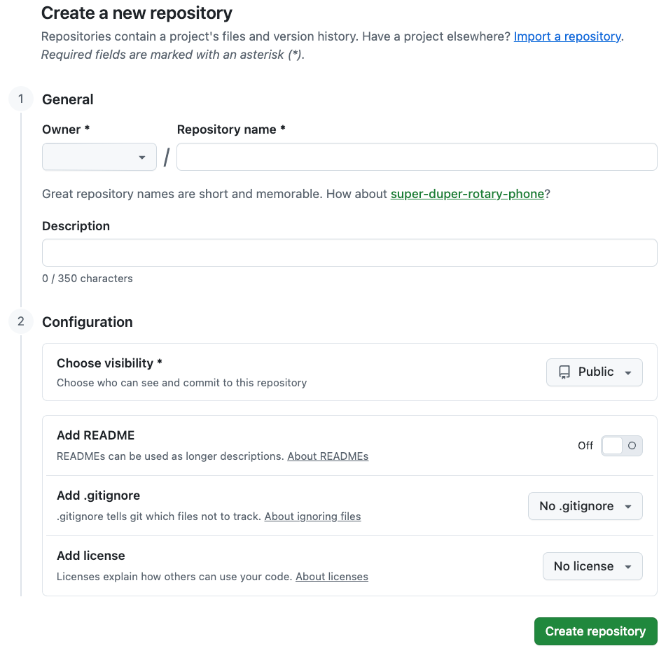
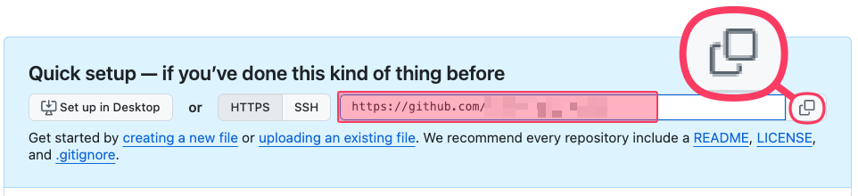

# [[Publishing]]
- Publishing a site means putting the project in GitHub and letting GitHub Pages build the public website from it.
    - You edit the Markdown files.
    - GitHub stores the project history.
    - GitHub Pages serves the finished `site/` folder.

# [[GitHub]] repository
- Create a GitHub account.
- On GitHub, open **New repository**.
    - {width="700"}
        - **General**
            - **Owner:** Choose the account that will own the site.
            - **Repository name:** Write the repository name, such as `course-notes`, or `research-methods`.
        - **Configuration**
            - **Choose visibility:** Select **Public**, unless you already know your GitHub plan (*paid*) supports the Pages visibility you need.
            - **Add README:** Leave this **Off**.
            - **Add .gitignore:** Leave this as **No .gitignore**.
            - **Add license:** Leave this as **No license**.
        - Click **Create repository**.
## Setup screen
- After the repository is created, GitHub shows the setup screen.
    - 
        - Copy the repository URL.
            - This URL will be used in the first publish commands after configuring project settings and turning on Github pages.

## Project configuration #settings
- Update the project information in [[zensical.toml]].
    - ```text linenums="1" hl_lines="3 4 9 10"
    # Project information
    [project]
    site_name = "My site name here"
    site_url = "https://username.github.io/repository/"
    docs_dir = "docs"
    site_dir = "site"

    # Repository
    repo_url = "https://github.com/username/repository"
    repo_name = "repository"
    edit_uri = "edit/main/docs/"
    ```
        - **Line 3:** Change `My site name here` to the name that should appear in the site header and browser tab.
        - **Line 4:** Replace `username` and `repository` with the GitHub account and repository name.
        - **Line 9:** Use the GitHub repository address, copied in the setup screen section.
        - **Line 10:** Use the repository name.

## Turning on [[Github]] Pages and first push
- GitHub Pages is the GitHub feature that turns the repository into a website.
- In the GitHub repository, open **Settings > Pages**.
    - Under **Build and deployment**, set **Source** to **GitHub Actions**.
- Run the following in the site folder `cd /path/to/my-site-folder` in [[terminal]]:
    - ```bash linenums="1" hl_lines="6"
    knotis serve
    git init
    git add .
    git commit -m "Publish"
    git branch -M main
    git remote add origin https://github.com/username/repository.git
    git push -u origin main
    ```
        - **Line 6:** Replace your repository URL with `https://github.com/USERNAME/REPOSITORY.git`.

# Publish changes later
- After the first publish, VS Code Source Control is the easiest way to send changes to GitHub.
    - In VS Code:
        1. Open the Knotis site folder.
        1. Edit and save your Markdown files, images, and `zensical.toml`.
        1. Open the **Source Control** view.
        1. Review the changed files.
        1. Type a short commit message, such as `Update week 3 notes` or simply `Edit`.
        1. Click **Commit**.
        1. Click **Sync Changes**.
    - GitHub Pages rebuilds after the push.
        - Use the **Actions** tab if you want to watch the deployment.
