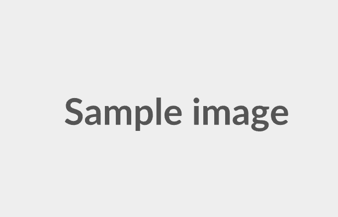
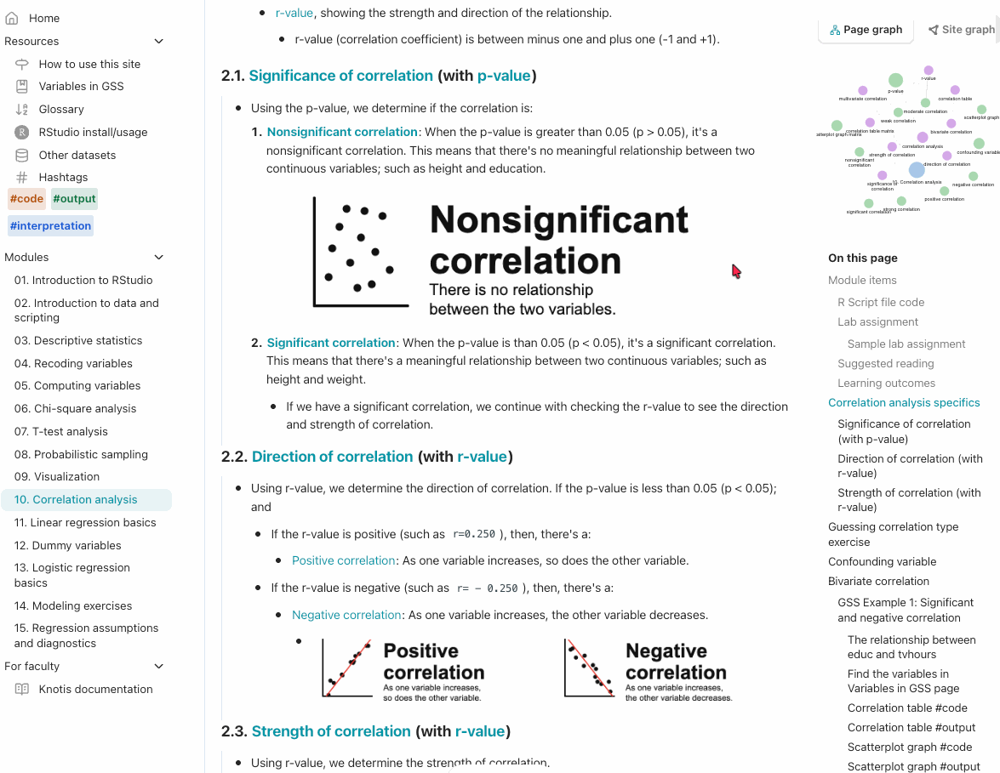
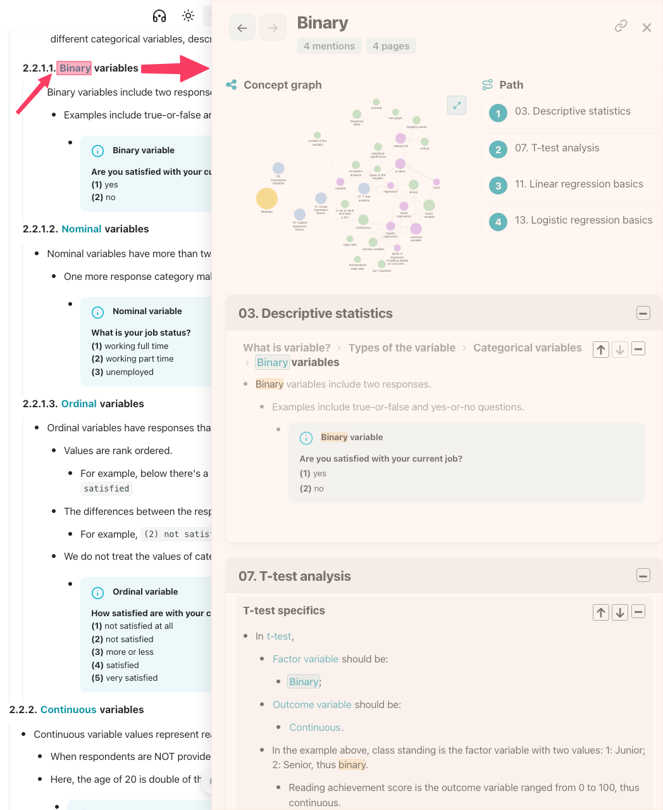
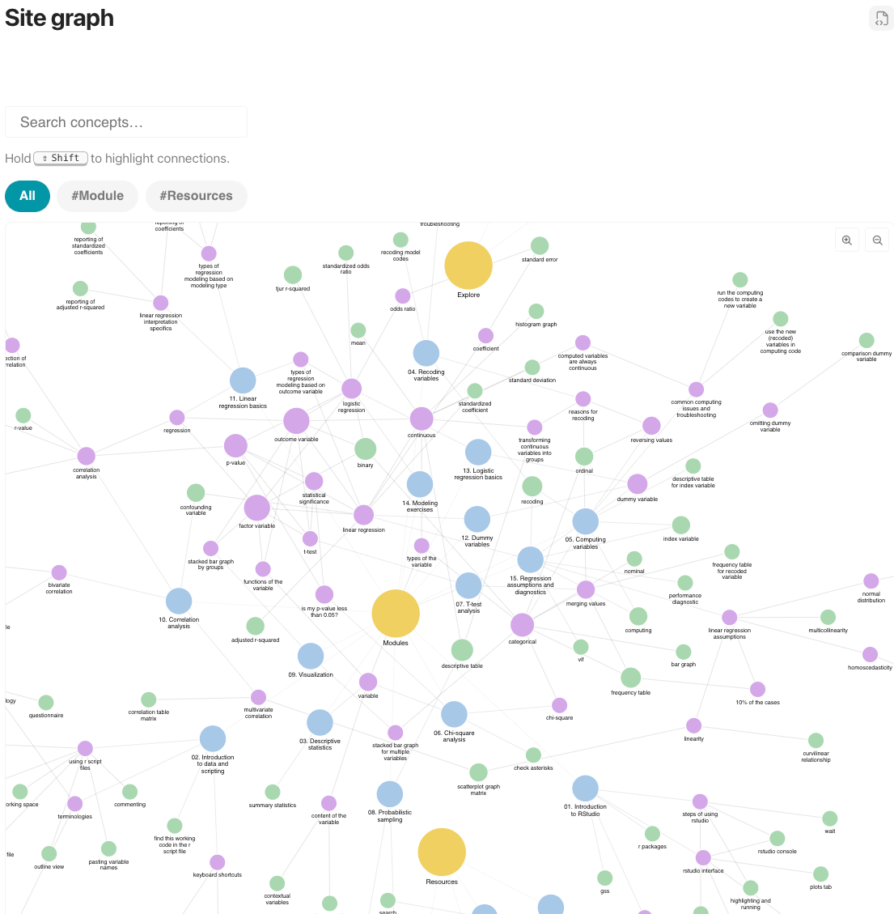
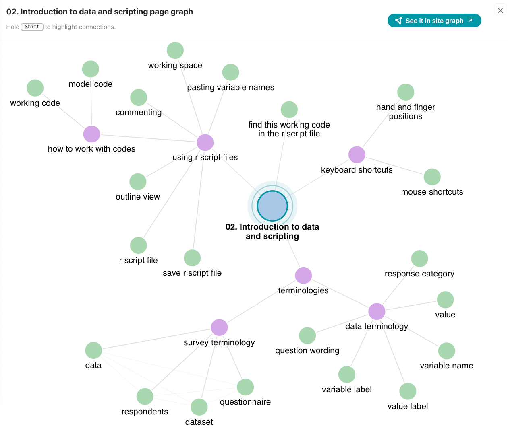
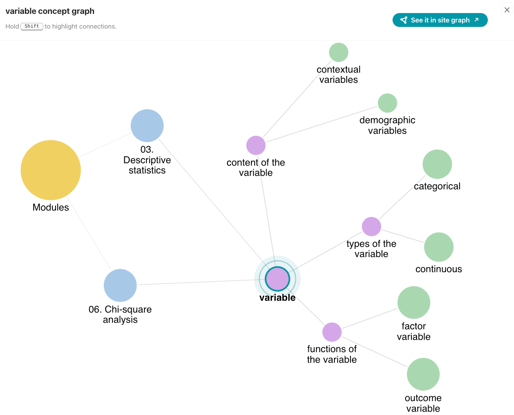
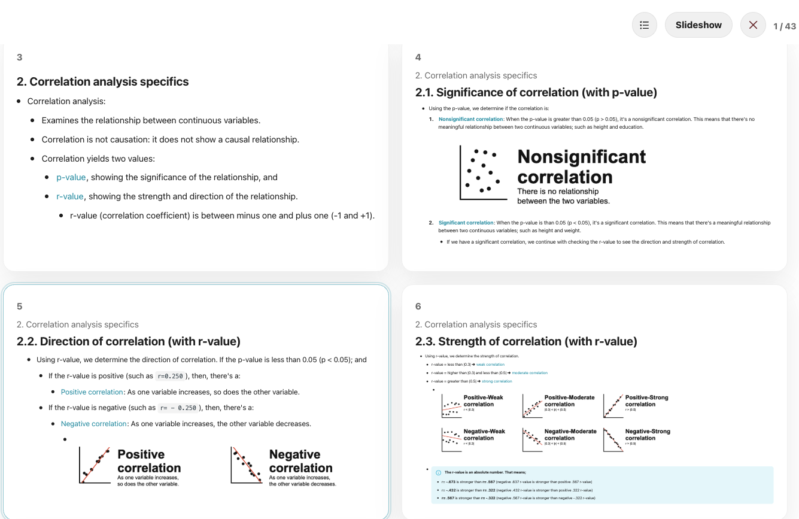
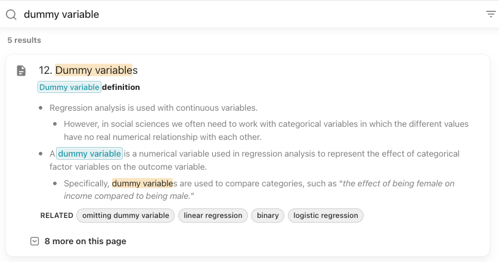
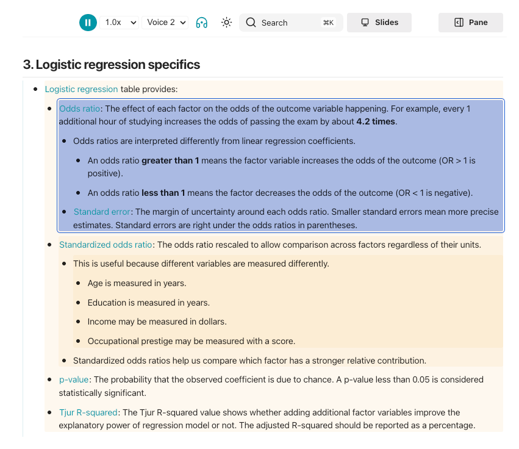
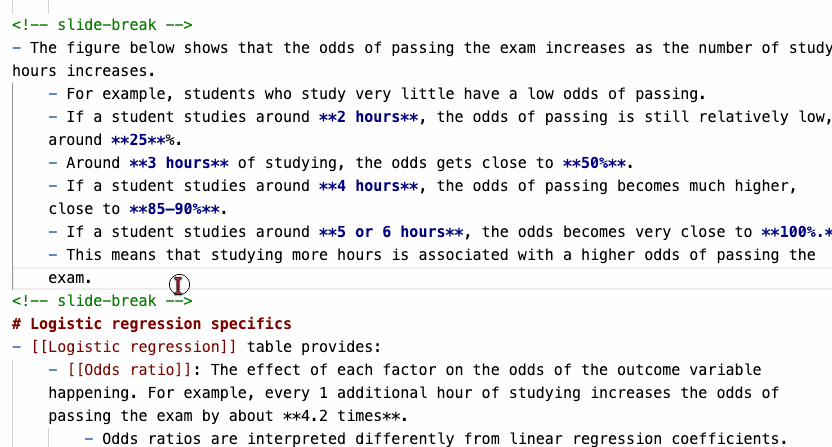

# [[Knotis]]
- Knotis is a teaching-focused wrapper for the [[Zensical]] static-site generator.
    - It provides tools for organizing instructional materials.
- Instructional notes are often spread across many pages.
    - A concept such as **survey** may be introduced on one page, explained on another, and used throughout the rest of the course.
        - Users who encounter the concept later have no easy way to find where it was first introduced or how it relates to other topics.
    - With Knotis, mark a concept once with double brackets, `[[ ]]`.
        - Every occurrence of that concept across the course becomes connected and mapped.
# [[Features at glance]]
## [[Outlining]]
- Knotis turns indentation into structure: bullets, numbered lists, Markdown tables, images, Mermaid diagrams, admonitions, code blocks, and videos form parent–child and sibling relationships.
    - These relationships become graph edges and determine the context shown in the pane.
    - Except for headings, each item is written with a bullet.
### [[Bullets]]
- Grandparent bullet
    - Parent bullet 1 (parent sibling 1)
    - Parent bullet 2 (parent sibling 2)
        - Child bullet 1 (child sibling 1)
        - Child bullet 2 (child sibling 2)
### [[Numbered list]]
1. Grandparent item
    1. Parent item 1 (parent sibling 1)
    2. Parent item 2 (parent sibling 2)
        1. Child item 1 (child sibling 1)
        2. Child item 2 (child sibling 2)
### [[Markdown table]]
- Sample markdown table:
    - | Syntax      | Description |
      | ----------- | ----------- |
      | Header      | Title       |
      | Paragraph   | Text        |
          - Child bullets and numbered lists are supported.

### [[Image]]
- Sample image:
    - {width="400"}
        - Child bullets and numbered lists are supported.
### [[Mermaid diagram]]
- Sample Mermaid diagram:
    - ```mermaid
    flowchart LR
    subgraph O1[Box 1]
        direction TB
        A[A]
    end

    subgraph O2[Box 2]
        B[B]
    end

    subgraph O3[Box 3]
        C[C]
    end

    subgraph O4[Box 4]
        D[D]
    end

    A -.->|Relationship| B
    B -.->|Relationship| C
    C -.->|Relationship| D
    ```
        - Child bullets and numbered lists are supported.

### [[Admonition]]
- Sample admonition:
    - !!! note "Sample admonition box"
        - Grandparent bullet
            - Parent bullet 1 (parent sibling 1)
            - Parent bullet 2 (parent sibling 2)
                - Child item 1 (child sibling 1)
                - Child item 2 (child sibling 2)

        - Child bullets and numbered lists are supported after a blank line.
### [[Code block]]
- Sample code block:
      - ```python linenums="1" hl_lines="1 3"
      name = "Alex"
      message = f"Hello, {name}!"
      print(message)
      ```
        - Child bullets and numbered lists are supported.

### [[Video]]
- Sample video:
    - {width="500"}
        - Child bullets and numbered lists are supported.
## [[Wikilink]]
- Wikilinks mark important terms as concepts that are connected across the site.
    - A wikilink is created by placing a concept inside double brackets, `[[ ]]`.
    - The bracketed text, such as [[pane]], becomes an interactive concept link wherever it appears.
        - In the examples above, ***Wikilink*** in the heading and ***pane*** are both wikilinks.
### [[Reference]]
- The `|ref` flag marks important passages for a concept.
- Add `|ref` to a wikilink, such as `[[sample reference|ref]]`.
    - [[sample reference|ref]]
- Instead of showing every occurrence of the concept, the pane can show only the content marked with `|ref`.
## [[Pane]]
- The pane is a side panel that opens when you click a [[wikilink]].
    - It shows every occurrence of that concept or hashtag across the site, along with its surrounding context.
    - Click ***Pane*** in the heading or ***wikilink*** in the text above to open the pane.
        - { width="500" }
## [[Graphs]]
- Mark concepts with a [[wikilink]] to show how they connect across pages and with one another.
    - Three graphs are automatically created from those connections:
        - **(1)** [[Site graph]], **(2)** [[Page graph]], and **(3)** [[Concept graph]]
### [[Site graph]]
- The full course map showing all the wikilinks.
    - { width="500" }
### [[Page graph]]
- One page and its concepts.
    - { width="500" }
### [[Concept graph]]
- One wikilink concept, its relationship with other concepts and its path across other pages.
    - { width="500" }
## [[Content tags]]
- A `#tag` labels a **section by content type**, not by concept.
    - Clicking a `#tag` in the navigation bar opens every section across the site.
        - { width="500" }
## [[Glossary]]
- The Glossary is an auto-generated page that lists every [[wikilink]] concept mentioned in the site.
    - { width="500" }
## [[Slide mode]]
- A page turns into a full-screen presentation.
    - 
## [[Search]]
- Search finds concepts, pages, and teaching content across the entire site or specific sections.
- Results show the matching part with its surrounding context.
    - Click a result to open that part directly.
        - 
## [[Read aloud]]
- A built-in text-to-speech button that reads a lesson page aloud, using the browser's own voice.
    - 
## [[Video controls]]
- Lightweight controls for videos, GIFs and MP4s, with the closed-caption support.
    - 
